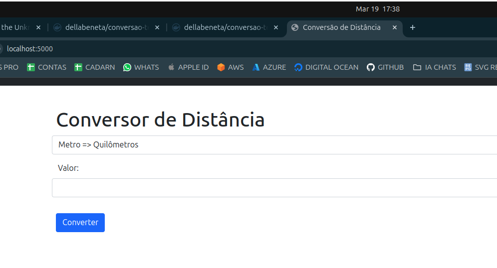
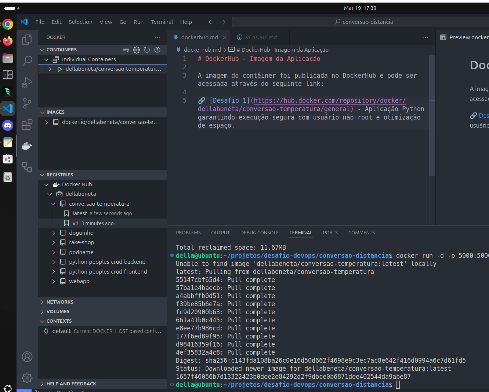

## Aplicação em Contêiner Docker

Este projeto containeriza uma aplicação Python usando Docker, garantindo execução segura com usuário não-root e otimização de espaço.

### Pré-requisitos

- Docker instalado
- Python 3.10 (apenas para desenvolvimento local)
- Arquivo `requirements.txt` com dependências

### Screenshots

<div align="left">
  
</div>

<div align="left">
  
</div>

### Começando

#### Construção da Imagem

```
docker build -t minha-app-python .
```

#### Execução do Contêiner

```bash
docker run -d --name meu-container -p 5000:5000 minha-app-python
```

### Configuração

#### Estrutura do Projeto

```
della@ubuntu:~/projetos/desafio-devops/conversao-distancia$ tree
.
├── app.py
├── Dockerfile
├── README.md
├── requirements.txt
└── templates
    └── index.html

2 directories, 5 files
```

### Portas

- A aplicação expõe a porta `5000` internamente
- Mapeie para outra porta host se necessário: `-p 8080:5000`

### Boas Práticas Implementadas

- Usuário não-root dedicado  
- Cache otimizado para dependências  
- Permissões corretas no filesystem  
- Imagem slim (base reduzida)  
- Limpeza de cache pip  


